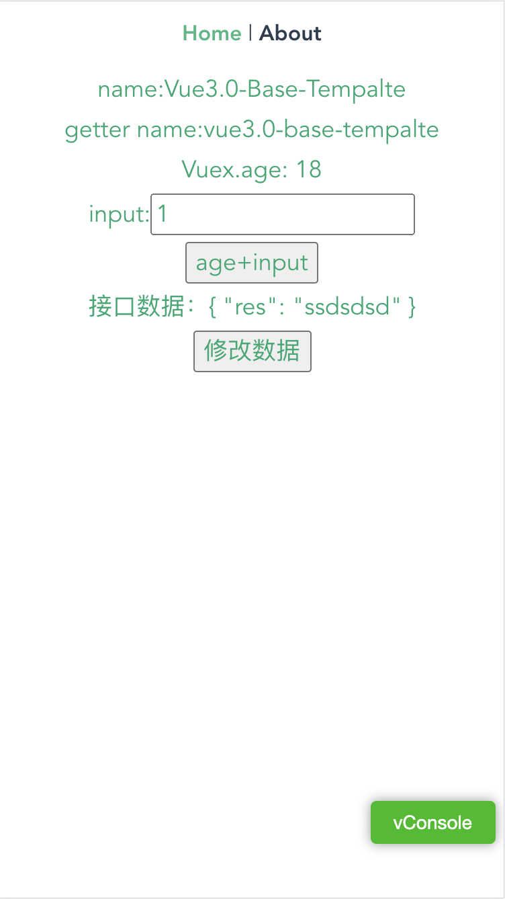
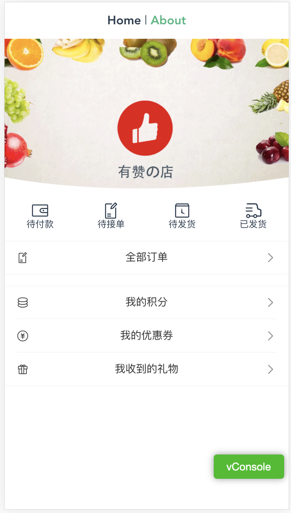

# vue3-base-template-H5
在[vue3-base-template](https://github.com/qixiaobro/vue3-base-template/tree/main)基础上进一步添加适合移动端H5的插件封装成的Vue3 H5模版框架。

## H5版本特有插件：
- [x] 引入[postcss-px-to-viewport](https://github.com/evrone/postcss-px-to-viewport/blob/master/README_CN.md)将px单位转换为视口单位的 (vw, vh, vmin, vmax) 的 PostCSS 插件。
- [x] 引入[vant](https://vant-contrib.gitee.io/vant/next/#/zh-CN) vue3版本的ui框架。默认会安装[vant-use:	Vant Composition API 合集](https://youzan.github.io/vant/vant-use/)。
- [x] ts按需引入vant组件插件[ts-import-plugin](https://github.com/Brooooooklyn/ts-import-plugin)。
- [x] 引入[vConsole](https://github.com/Tencent/vConsole/blob/dev/README_CN.md) 针对手机网页的前端开发者调试面板。

## 项目需求插件推荐： 
* [smoothscroll-polyfill](https://github.com/jonaskuske/smoothscroll-anchor-polyfill) 页面平滑滚动补充插件，解决移动端通过js操作滚动不平滑问题。 
* [clipboard](https://clipboardjs.com/) 文本一键复制插件。 
* [vue-awesome-swiper](https://github.com/surmon-china/vue-awesome-swiper) 轮播滑动插件。 
* [html2canvas](https://html2canvas.hertzen.com/) DOM转图片插件，推荐安装`1.0.0-rc.4`版本，高版本的在ios13上有bug。 

## demo页面：



## vue3-base-template-H5 vue.config.js 配置如下：
```js
const path = require("path");

const CompressionWebpackPlugin = require("compression-webpack-plugin");
const zopfli = require("@gfx/zopfli");
const BrotliPlugin = require("brotli-webpack-plugin");
const productionGzipExtensions = /\.(js|css|json|txt|html|ico|svg)(\?.*)?$/i;
const merge = require("webpack-merge");
const tsImportPluginFactory = require("ts-import-plugin");
const autoprefixer = require("autoprefixer");
const pxtoviewport = require("postcss-px-to-viewport");

const resolve = dir => path.join(__dirname, dir);

const BundleAnalyzerPlugin = require("webpack-bundle-analyzer")
  .BundleAnalyzerPlugin;

const IS_PROD = ["production", "prod"].includes(process.env.NODE_ENV);

module.exports = {
  publicPath: IS_PROD ? process.env.VUE_APP_PUBLIC_PATH : "./",
  outputDir: process.env.outputDir || "dist", //生产环境构建文件的目录
  assetsDir: "", //// 相对于outputDir的静态资源(js、css、img、fonts)目录
  indexPath: "index.html", //指定生成的 index.html 的输出路径 (相对于 outputDir)。也可以是一个绝对路径
  lintOnSave: process.env.NODE_ENV !== "production",
  runtimeCompiler: true, // 是否使用包含运行时编译器的 Vue 构建版本
  productionSourceMap: !IS_PROD, // 生产环境的 source map
  parallel: false, //要设置为false，否则vant按需引入打包生产后样式会失效
  pwa: {},

  chainWebpack: config => {
    /**
     * @TODO 修复HMR(热更新)失效
     */
    config.resolve.symlinks(true);

    /**
     * @TODO 添加别名
     */
    config.resolve.alias
      .set("@", resolve("src"))
      .set("@assets", resolve("src/assets"))
      .set("@components", resolve("src/components"))
      .set("@plugins", resolve("src/plugins"))
      .set("@views", resolve("src/views"))
      .set("@router", resolve("src/router"))
      .set("@store", resolve("src/store"))
      .set("@utils", resolve("src/utils"));

    //@TODO vant组件按需引入
    config.module
      .rule("ts")
      .use("ts-loader")
      .tap(options => {
        options = merge(options, {
          transpileOnly: true,
          getCustomTransformers: () => ({
            before: [
              tsImportPluginFactory({
                libraryName: "vant",
                libraryDirectory: "es",
                style: true
              })
            ]
          }),
          compilerOptions: {
            module: "es2015"
          }
        });
        return options;
      });

    /**
     * @TODO 压缩图片
     */
    if (IS_PROD) {
      config.module
        .rule("images")
        .use("image-webpack-loader")
        .loader("image-webpack-loader")
        .options({
          mozjpeg: { progressive: true, quality: 65 },
          optipng: { enabled: false },
          pngquant: { quality: [0.65, 0.9], speed: 4 },
          gifsicle: { interlaced: false }
          // webp: { quality: 75 }
        });
    }

    // 最小化代码
    config.optimization.minimize(true);
    // 分割代码
    config.optimization.splitChunks({
      chunks: "all"
    });

    /**
     * @TODO 打包后文件大小分析
     */
    if (IS_PROD) {
      config.plugin("webpack-report").use(BundleAnalyzerPlugin, [
        {
          analyzerMode: "static"
        }
      ]);
    }
  },

  /**
   * @TODO 比 gzip 体验更好的 Zopfli 压缩
   */
  configureWebpack: config => {
    const plugins = [];
    if (IS_PROD) {
      plugins.push(
        new CompressionWebpackPlugin({
          algorithm(input, compressionOptions, callback) {
            return zopfli.gzip(input, compressionOptions, callback);
          },
          compressionOptions: {
            numiterations: 15
          },
          minRatio: 0.99,
          test: productionGzipExtensions
        })
      );
      plugins.push(
        new BrotliPlugin({
          test: productionGzipExtensions,
          minRatio: 0.99
        })
      );
    }
    config.plugins = [...config.plugins, ...plugins];

    // 公共代码抽离
    config.optimization = {
      splitChunks: {
        cacheGroups: {
          vendor: {
            chunks: "all",
            test: /node_modules/,
            name: "vendor",
            minChunks: 1,
            maxInitialRequests: 5,
            minSize: 0,
            priority: 100
          },
          common: {
            chunks: "all",
            test: /[\\/]src[\\/]js[\\/]/,
            name: "common",
            minChunks: 2,
            maxInitialRequests: 5,
            minSize: 0,
            priority: 60
          },
          styles: {
            name: "styles",
            test: /\.(sa|sc|c)ss$/,
            chunks: "all",
            enforce: true
          },
          runtimeChunk: {
            name: "manifest"
          }
        }
      }
    };
  },

  css: {
    extract: IS_PROD,
    sourceMap: !IS_PROD,
    loaderOptions: {
      less: {
        globalVars: {},
        lessOptions: {
          javascriptEnabled: true
        }
      },
      postcss: {
        plugins: [
          autoprefixer(),
          pxtoviewport({
            viewportWidth: 375
          })
        ]
      }
    }
  },
  pluginOptions: {
    /** 全局加载less 的 webpack 插件  */
    "style-resources-loader": {
      preProcessor: "less",
      patterns: [path.resolve(__dirname, "./src/styles/index.less")]
    }
  },

  /**
   * @TODO 配置proxy代理解决跨域问题
   */
  devServer: {
    // overlay: { // 让浏览器 overlay 同时显示警告和错误
    //   warnings: true,
    //   errors: true
    // },
    open: true, // 是否打开浏览器
    // host: "localhost",
    // port: "8080", // 代理端口
    // https: false,
    hotOnly: true, // 热更新
    proxy: {
      "/api": {
        target:
          "https://www.fastmock.site/mock/1f35985adb58af2c3341fd7803d8540f", // 目标代理接口地址
        secure: false,
        changeOrigin: true // 开启代理，在本地创建一个虚拟服务端
        // ws: true, // 是否启用websockets
        // pathRewrite: {
        //   "^/api": "/"
        // }
      }
    }
  }
};

```

[vue3-base-template](https://github.com/qixiaobro/vue3-base-template/tree/main)的配置如下： 

基本配置：
- [x] vue.config.js 配置
- [x] vuex  /模块分解
- [x] vue-router
- [x] type /typescript 类封装
- [x] axios封装
- [x] .env  .env.production
- [x] utils  /工具封装
- [x] styles
- [x] api模块
- [x] less
- [x] 添加`vue-composable`插件。[官方文档](https://pikax.me/vue-composable/),好东西！极力推荐！！！

`vue.config.js`配置:

- [x] 修复HMR(热更新)失效
- [x] 添加别名
- [x] `image-webpack-loader`压缩图片
- [x] `webpack-bundle-analyzer`打包后文件大小分析
- [x] 比 gzip 体验更好的 Zopfli 压缩
- [x] 配置proxy代理解决跨域问题
- [x] 去除`console`
- [x] less css预设

配置如下：
```js
// eslint-disable-next-line @typescript-eslint/no-var-requires
const path = require("path");

// eslint-disable-next-line @typescript-eslint/no-var-requires
const CompressionWebpackPlugin = require("compression-webpack-plugin");
// eslint-disable-next-line @typescript-eslint/no-var-requires
const zopfli = require("@gfx/zopfli");
// eslint-disable-next-line @typescript-eslint/no-var-requires
const BrotliPlugin = require("brotli-webpack-plugin");
const productionGzipExtensions = /\.(js|css|json|txt|html|ico|svg)(\?.*)?$/i;

const resolve = dir => path.join(__dirname, dir);

const BundleAnalyzerPlugin = require("webpack-bundle-analyzer")
  .BundleAnalyzerPlugin;

const IS_PROD = ["production", "prod"].includes(process.env.NODE_ENV);

module.exports = {
  publicPath: IS_PROD ? process.env.VUE_APP_PUBLIC_PATH : "./",
  outputDir: process.env.outputDir || "dist", //生产环境构建文件的目录
  assetsDir: "", //// 相对于outputDir的静态资源(js、css、img、fonts)目录
  indexPath: "index.html", //指定生成的 index.html 的输出路径 (相对于 outputDir)。也可以是一个绝对路径
  lintOnSave: process.env.NODE_ENV !== "production",
  runtimeCompiler: true, // 是否使用包含运行时编译器的 Vue 构建版本
  productionSourceMap: !IS_PROD, // 生产环境的 source map
  parallel: require("os").cpus().length > 1, //该选项在系统的 CPU 有多于一个内核时自动启用，仅作用于生产构建。
  pwa: {},

  chainWebpack: config => {
    /**
     * @TODO 修复HMR(热更新)失效
     */
    config.resolve.symlinks(true);

    /**
     * @TODO 添加别名
     */
    config.resolve.alias
      .set("@", resolve("src"))
      .set("@assets", resolve("src/assets"))
      .set("@components", resolve("src/components"))
      .set("@plugins", resolve("src/plugins"))
      .set("@views", resolve("src/views"))
      .set("@router", resolve("src/router"))
      .set("@store", resolve("src/store"))
      .set("@utils", resolve("src/utils"));

    /**
     * @TODO 压缩图片
     */
    if (IS_PROD) {
      config.module
        .rule("images")
        .use("image-webpack-loader")
        .loader("image-webpack-loader")
        .options({
          mozjpeg: { progressive: true, quality: 65 },
          optipng: { enabled: false },
          pngquant: { quality: [0.65, 0.9], speed: 4 },
          gifsicle: { interlaced: false }
          // webp: { quality: 75 }
        });
    }

    // 最小化代码
    config.optimization.minimize(true);
    // 分割代码
    config.optimization.splitChunks({
      chunks: "all"
    });

    /**
     * @TODO 打包后文件大小分析
     */
    if (IS_PROD) {
      config.plugin("webpack-report").use(BundleAnalyzerPlugin, [
        {
          analyzerMode: "static"
        }
      ]);
    }
  },

  /**
   * @TODO 比 gzip 体验更好的 Zopfli 压缩
   */
  configureWebpack: config => {
    const plugins = [];
    if (IS_PROD) {
      plugins.push(
        new CompressionWebpackPlugin({
          algorithm(input, compressionOptions, callback) {
            return zopfli.gzip(input, compressionOptions, callback);
          },
          compressionOptions: {
            numiterations: 15
          },
          minRatio: 0.99,
          test: productionGzipExtensions
        })
      );
      plugins.push(
        new BrotliPlugin({
          test: productionGzipExtensions,
          minRatio: 0.99
        })
      );
    }
    config.plugins = [...config.plugins, ...plugins];

    // 公共代码抽离
    config.optimization = {
      splitChunks: {
        cacheGroups: {
          vendor: {
            chunks: "all",
            test: /node_modules/,
            name: "vendor",
            minChunks: 1,
            maxInitialRequests: 5,
            minSize: 0,
            priority: 100
          },
          common: {
            chunks: "all",
            test: /[\\/]src[\\/]js[\\/]/,
            name: "common",
            minChunks: 2,
            maxInitialRequests: 5,
            minSize: 0,
            priority: 60
          },
          styles: {
            name: "styles",
            test: /\.(sa|sc|c)ss$/,
            chunks: "all",
            enforce: true
          },
          runtimeChunk: {
            name: "manifest"
          }
        }
      }
    };
  },

  css: {
    extract: IS_PROD,
    sourceMap: !IS_PROD,
    loaderOptions: {
      less: {
        globalVars: {},
        lessOptions: {
          javascriptEnabled: true
        }
      }
    }
  },
  pluginOptions: {
    /** 全局加载less 的 webpack 插件  */
    "style-resources-loader": {
      preProcessor: "less",
      patterns: [path.resolve(__dirname, "./src/styles/index.less")]
    }
  },

  /**
   * @TODO 配置proxy代理解决跨域问题
   */
  devServer: {
    // overlay: { // 让浏览器 overlay 同时显示警告和错误
    //   warnings: true,
    //   errors: true
    // },
    open: true, // 是否打开浏览器
    // host: "localhost",
    // port: "8080", // 代理端口
    // https: false,
    hotOnly: true, // 热更新
    proxy: {
      "/api": {
        target:
          "https://www.fastmock.site/mock/1f35985adb58af2c3341fd7803d8540f", // 目标代理接口地址
        secure: false,
        changeOrigin: true // 开启代理，在本地创建一个虚拟服务端
        // ws: true, // 是否启用websockets
        // pathRewrite: {
        //   "^/api": "/"
        // }
      }
    }
  }
};
```
## Clone  `vue3-base-template-H5`
```
git clone -b vue3-base-template-H5 git@github.com:qixiaobro/vue3-base-template.git
```

## Project setup
```
npm install
```

### Compiles and hot-reloads for development
```
npm run serve
```

### Compiles and minifies for production
```
npm run build
```

### Run your unit tests
```
npm run test:unit
```

### Lints and fixes files
```
npm run lint
```
